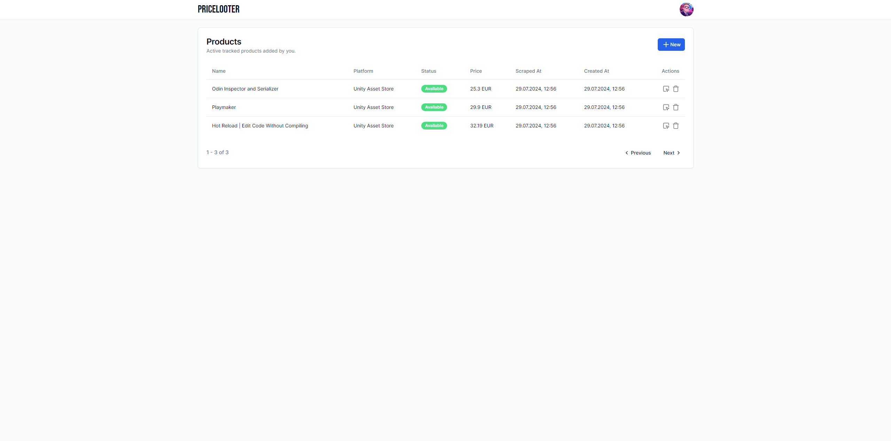

<h1 align="center">Pricelooter</h1>

</img>

Pricelooter is a simple fullstack application for tracking products and their prices. Every time the price of a product is reduced, the user gets an email notification.

The number of supported platforms depends on the number of implemented scrapers. Pricelooter only support [Unity Asset Store](https://assetstore.unity.com/) for now as a starting platform, but can be easily extended.

## Getting Started

Several dependencies are needed:

-   Docker
-   Node.js
-   PNPM

To run application locally, follow instructions:

```
Since it's NX monorepo, all commands should be run in the root folder.
```

1. Install all dependencies by `pnpm install`
2. Start docker images by `docker compose -f docker-compose.dev.yaml up -d`
3. Copy `.env.example` file and change its name to `.env.development`. App is designed in a way to work with default variables when running local environment, but feel free to adjust them into your needs.
4. Apply prisma migrations by running `pnpm migrate:dev`
5. Run application with `pnpm dev`. It will start processes for all apps/packages with hot reloading and logging enabled.

Services table (according to default configuration):

| Name        | URL                         |
| ----------- | --------------------------- |
| Frontend    | http://localhost:8000       |
| Backend     | http://localhost:3000       |
| Admin Panel | http://localhost:5000/admin |
