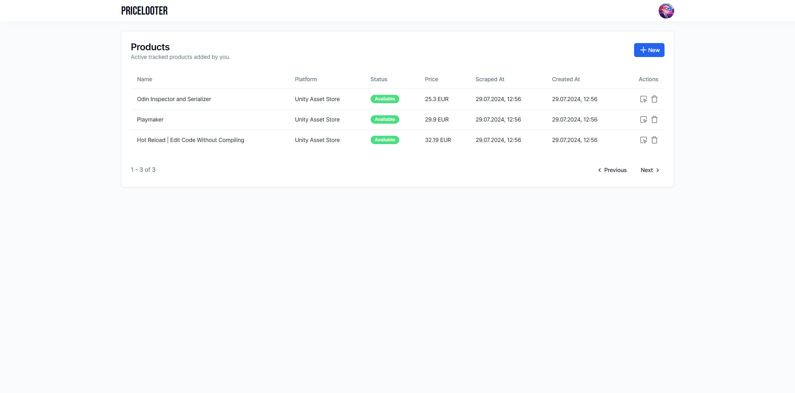

<h1 style="text-align: center;">Pricelooter</h1>

</img>

Pricelooter is a simple fullstack application for tracking products and their prices. Every time the price of a product is reduced, the user gets an email notification.

The number of supported platforms depends on the number of implemented scrapers. Pricelooter only support [Unity Asset Store](https://assetstore.unity.com/) for now as a starting platform, but can be easily extended.

## Getting Started

To run application locally, we need several dependencies:

-   Docker
-   Node.js
-   PNPM
